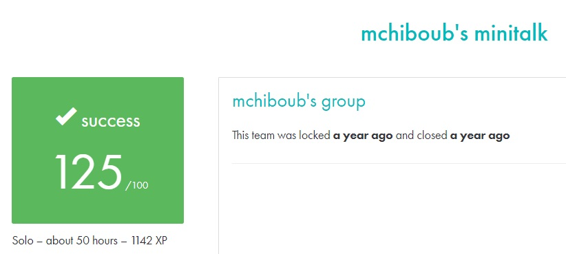

# MINITALK #

## What the project does: ##
The Minitalk project involves creating a communication system between a client and a server using UNIX signals. The client sends a string to the server, which then receives and displays it. This communication is done using only two signals, SIGUSR1 and SIGUSR2.

## Why the project is useful: ##
This project is useful because it teaches how to handle inter-process communication (IPC) using UNIX signals. It also introduces you to low-level system programming concepts like signal handling, process IDs, and synchronization, which are critical for building efficient, event-driven programs.

[Subject of this project](en.subject.pdf)